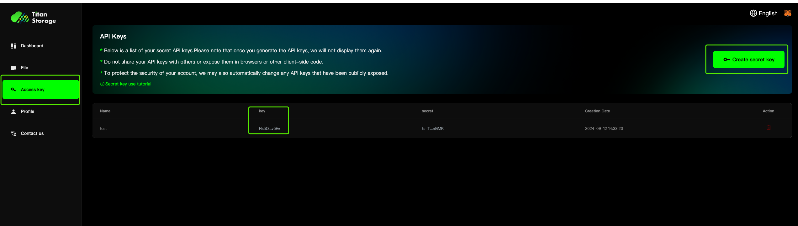

## Titan Storage Go SDK
The Titan Storage Go SDK provides functionalities for file uploading, downloading, deleting, renaming, sharing, and creating folders.

The Go SDK consists of TitanStorage.

### Install Go SDK And initialize the go SDK
```bash
go get -u github.com/utopiosphe/titan-storage-sdk
```

Retrieve the apikey and use it to initialize the go SDK



```go
package main

import (
    storage "github.com/utopiosphe/titan-storage-sdk"
)

const (
    titanStorageURL = "https://api-test1.container1.titannet.io"
)

var storageCli storage.Storage

func init() {
    var err error

    storageCli,err = storage.Initialize(&storage.Config{
        TitanURL: titanStorageURL,
        APIKey: os.Getenv("apikey"),
    })
    if err != nil {
        panic(fmt.Errorf("new client of titan storage error:%w",err))
    }
}
```

### Go SDK Method With Client
|Method|Description|
|:-|:-|
|ListRegions|Retrieve the list of area IDs from the scheduler|
|CreateFolder|Create directories, including root and subdirectories|
|ListDirectoryContents|Retrieve a list of all folders and files|
|RenameFolder|Rename a specific folder|
|RenameAsset|Rename a specific file|
|DeleteFolder|Delete a specific folder|
|DeleteAsset|Delete a specific file|
|GetUserProfile|Retrieve user-related information|
|GetltemDetails|Get detailed information about files/folders|
|CreateSharedLink|Share file/folder data|
|UploadAsset|Upload files/folders|
|DownloadAsset|Download files/folders|