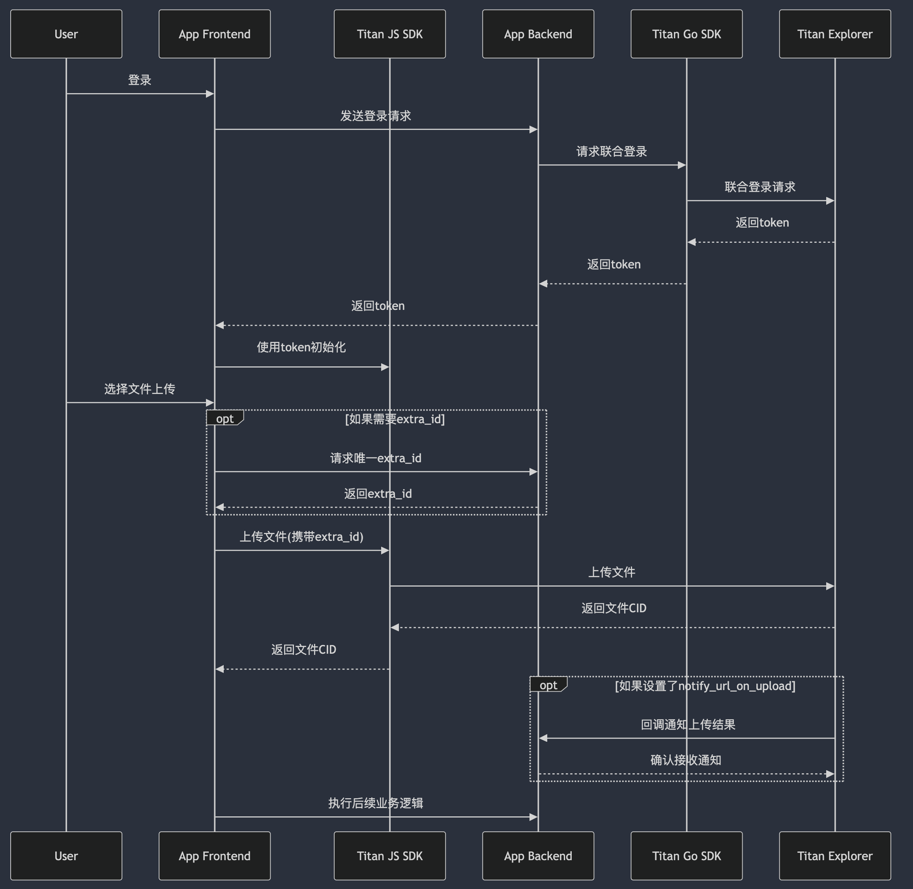

# 第三方应用接入 Titan 去中心化存储流程

## 对象
- **Titan-explorer (te)**: Titan 浏览器，负责管理和使用 Titan 的去中心化存储设施。
- **Titan-go-sdk (gosdk)**: Titan 的 Go 语言 SDK，负责第三方应用服务端接入 Titan 存储，包括账户系统接入、权限控制、子账户生命周期管理等。
- **Titan-js-sdk (jssdk)**: Titan 的 JavaScript 前端 SDK，负责第三方应用客户端接入 Titan 存储，支持文件操作、上传下载服务等。
- **YOUR-APP (app)**: 您的应用，包含账户主体信息和至少一个可访问的服务端地址。

## 前置条件
1. 注册租户信息，提供账户主体信息，通过 Titan 浏览器进行注册。
2. 设置您的 API Key 和 API Secret，妥善保存以避免泄漏。
3. 设置 `notify_url_on_upload`（可选），当子账户创建文件资产成功时，异步通知该 URL。
4. 设置 `notify_url_on_delete`（可选），当子账户删除文件资产成功时，异步通知该 URL。

## 文件上传接入流程

1. **用户登录**: 用户通过 app 前端登录，并将请求发送至 app 后端。
2. **联合登录**: app 使用 gosdk 请求 te 进行联合登录，成功后返回 token 给 app（如子账户不存在，则会自动创建）。
3. **前端初始化**: app 前端使用 token 初始化 jssdk。
4. **上传任务初始化**: app 前端通过后端获取唯一的 `extra_id`（可选）。
5. **文件上传**: app 前端通过 jssdk 上传文件（携带 `extra_id`，如果需要）。
6. **文件上传完成**: 上传完成后获取文件 CID，执行后续业务逻辑（如果需要）。
7. **回调通知**: 如果存在 `extra_id`，te 将调用 `notify_url_on_upload` 回调通知 app 后端文件上传结果及摘要。

## 注意事项
1. **Token 生命周期管理**: 子账户的 token 需要通过 app 后端使用 gosdk 管理。当 jssdk 返回 401 错误时，app 前端需要续期 token。
2. **文件资产摘要管理**: 如果第三方系统不需要管理文件资产摘要信息，可以忽略 `extra_id` 和 `notify_url_on_upload`。
3. **签名验证**: 回调过程中需要验证来自 te 的签名和数据完整性，请参考 gosdk 中的 `ValidateUploadCallback`。
4. **回调重试机制**: 回调成功的标志是返回状态码为 200 且响应体内容为 `success`。若回调失败，将按照以下间隔重试：0秒、10秒、30秒、1分钟、5分钟、10分钟、1小时、24小时，直到完全失败。

