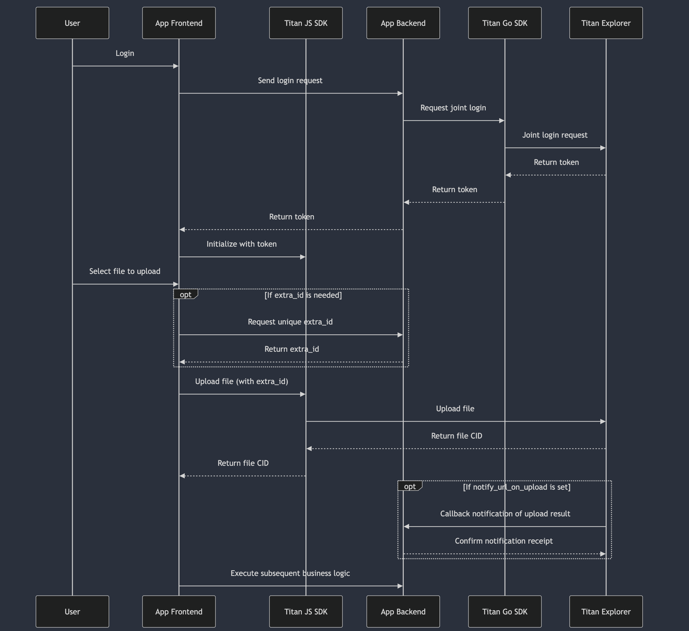

# Third-party Application Integration with Titan Decentralized Storage

## Entities
- **Titan-explorer (te)**: The Titan browser, responsible for managing and utilizing Titan's decentralized storage facilities.
- **Titan-go-sdk (gosdk)**: Titan's Go server SDK, responsible for server-side integration with Titan storage, including account system integration, permission control, and sub-account lifecycle management.
- **Titan-js-sdk (jssdk)**: Titan's JavaScript front-end SDK, responsible for client-side integration with Titan storage, supporting file operations and basic upload/download services.
- **YOUR-APP (app)**: Your application, which contains complete account information and at least one accessible server address.

## Prerequisites
1. Register your tenant information by providing account details through the Titan browser.
2. Set your API Key and API Secret, and store them securely to avoid any leaks.
3. Set `notify_url_on_upload` (optional) to receive asynchronous notifications when a sub-account successfully creates a file asset.
4. Set `notify_url_on_delete` (optional) to receive asynchronous notifications when a sub-account successfully deletes a file asset.

## File Upload Integration Process

1. **User Login**: The user logs in through the app front-end, which then communicates with the app back-end.
2. **Joint Login**: The app requests te for joint login using gosdk; upon success, a token is returned to the app (a new sub-account will be created if it does not exist).
3. **Front-end Initialization**: The app front-end initializes the jssdk using the token.
4. **Upload Task Initialization**: The app front-end retrieves a unique `extra_id` from the app back-end (optional).
5. **File Upload**: The app front-end uploads the file using jssdk (including `extra_id` if required).
6. **Upload Completion**: Upon completion, the app retrieves the file CID and performs any necessary business logic.
7. **Callback Notification**: If an `extra_id` is present, te will callback the `notify_url_on_upload` to inform the app back-end of the file upload result and summary.

## Notes
1. **Token Lifecycle Management**: The sub-account's token must be managed using gosdk on the app back-end. If jssdk returns a 401 error, the app front-end should renew the token.
2. **File Asset Summary Management**: If the third-party system does not need to manage file asset summaries, the `extra_id` and `notify_url_on_upload` can be ignored.
3. **Signature Verification**: During the callback process, verify the signature from te by referring to `ValidateUploadCallback` in gosdk.
4. **Callback Retry Mechanism**: A successful callback is indicated by a 200 status code and a response body containing `success`. If the callback fails, it will retry at the following intervals: 0s, 10s, 30s, 1min, 5min, 10min, 1hr, 24hr, until completely failed.
